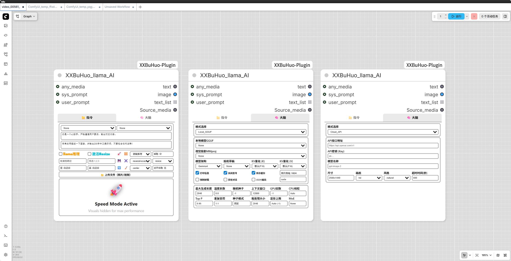
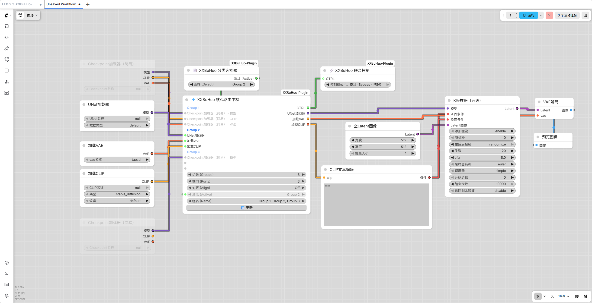
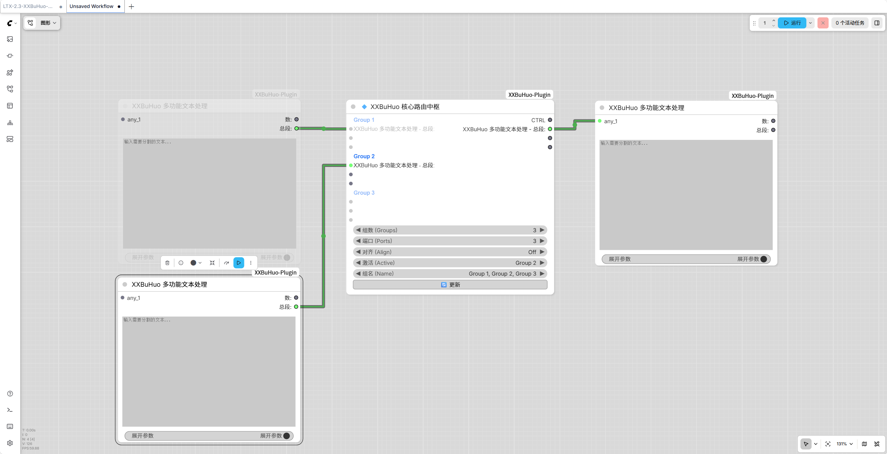
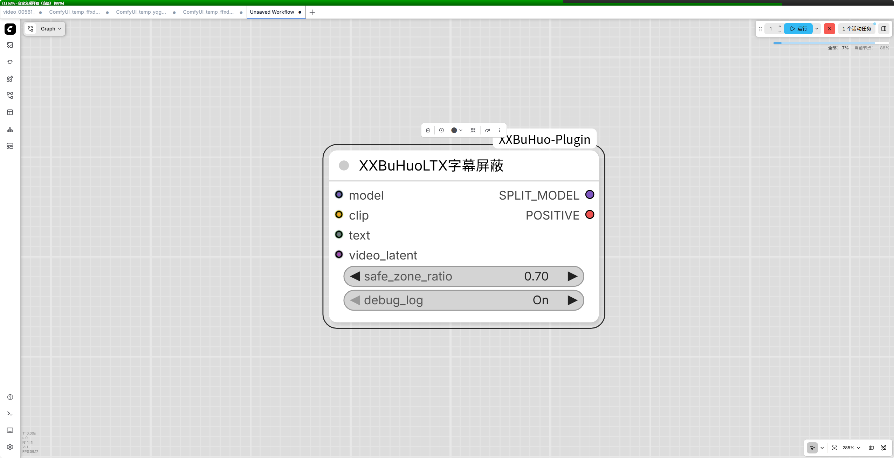
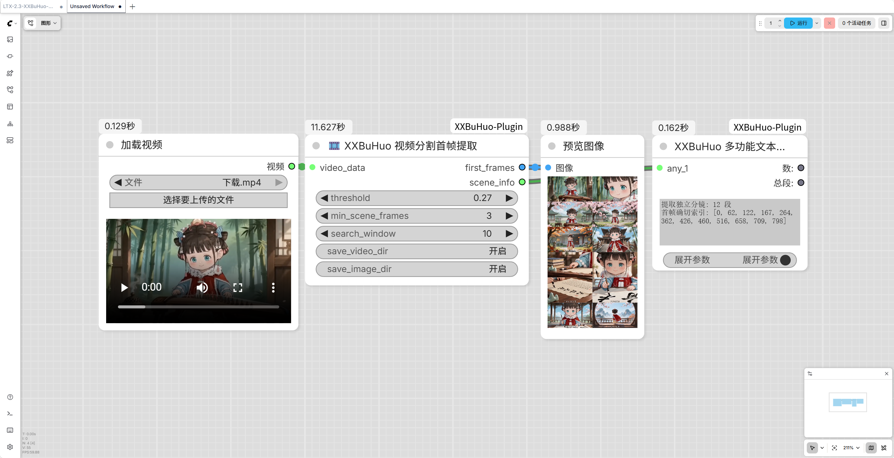
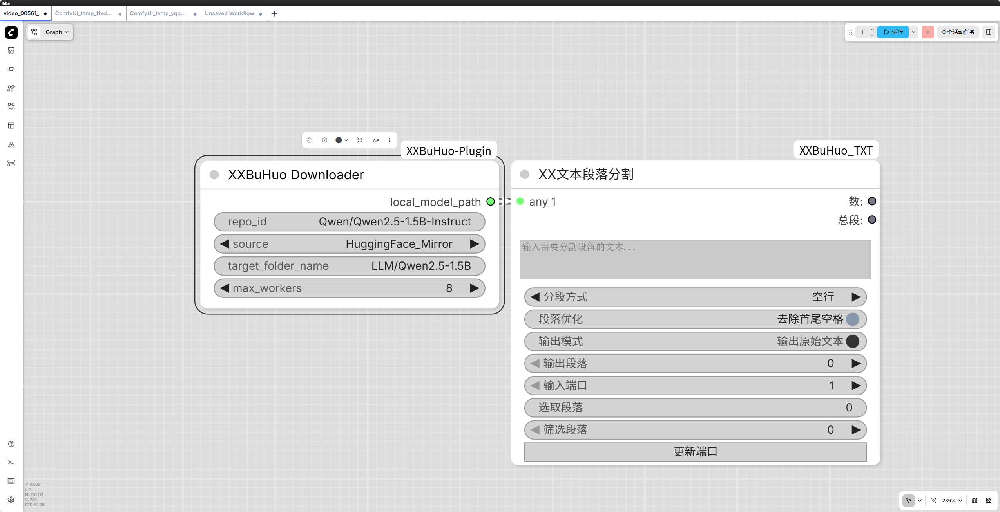
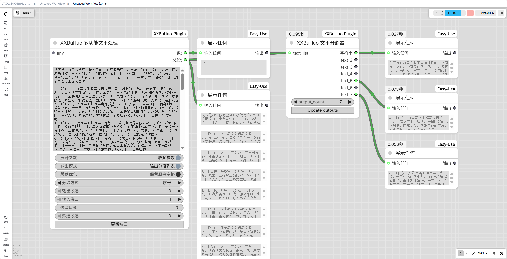
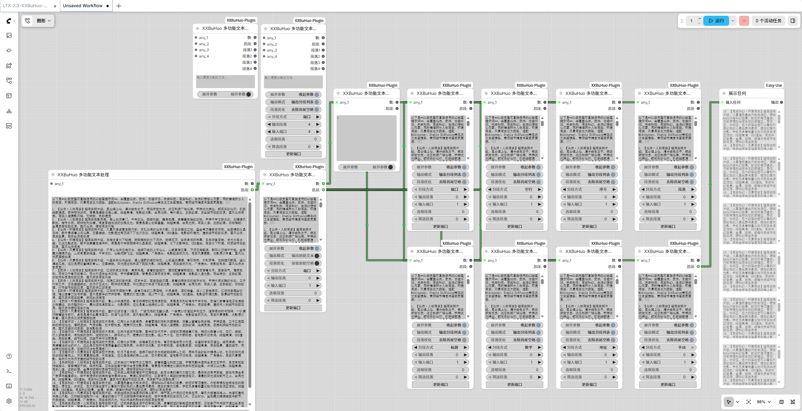
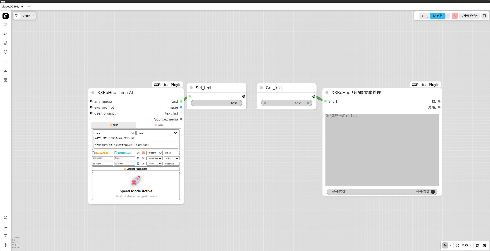
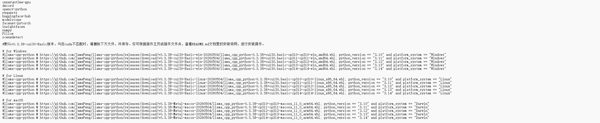

# 🚀 ComfyUI-XXBuHuo-Plugin 


欢迎使用 ComfyUI-XXBuHuo-Plugin，作为一个持续进化的“插件集”，未来所有隶属于 `XXBuHuo` 命名规范的新功能节点均会集成于此。

---

## 📑 目录 (Table of Contents)
- [✨ 节点与功能概览](#-节点与功能概览)
- [📖 核心模块详解](#-核心模块详解)
- [💡 List (列表) 与 Batch (批处理) 的区别](#list-batch)
- [📦 模型下载与存放路径](#-模型下载与存放路径)
- [🛠️ 安装指南](#️-安装指南)

---

## ✨ 节点与功能概览

| 节点分类 | 节点名称 | 功能简介 | 快速跳转 |
| :--- | :--- | :--- | :--- |
| **智能推理** | `XXBuHuo_llama_AI` | 本地/云端API多模态推理，内置视频抽帧与人脸精准裁切对齐。 | [查看详情](#1-xxbuhuo_llama_ai) |
| **路由控制** | `XXBuHuo_CategorySelector` | 路由选择器，提供全局分支选择，一键切换并激活指定工作流路线。 | [查看详情](#2-工作流路由控制组-nexus-router) |
| | `XXBuHuo_NexusRouter` | 逻辑分发节点，接收信号并支持多端口、多分支模型分类无缝切换。 | [查看详情](#2-工作流路由控制组-nexus-router) |
| | `XXBuHuo_JointController` | 联合控制器，配合路由自动将闲置分支的节点设为“静音”或“绕过”释放算力。 | [查看详情](#2-工作流路由控制组-nexus-router) |
| **视频优化** | `XXBuHuo_LTX_Subtitle_Blocker`| 拦截 LTX-Video 底层注意力特征，从源头消除视频底部乱码字幕。 | [查看详情](#3-视频处理与优化组件) |
| | `XXBuHuo_VideoSceneSplitter` | 自动识别视频转场（切镜），将视频分割成多个独立片段并提取清晰首帧。 | [查看详情](#4-xxbuhuo_videoscenesplitter-视频分割首帧提取) |
| **模型下载** | `XXBuHuo_Downloader` | 集成魔搭 (ModelScope) 与 HF 镜像源的高并发模型下载工具。 | [查看详情](#5-xxbuhuo_downloader-模型下载器) |
| **图像处理** | `XXBuHuoImageSplitter` | 将输入的图像批处理 (Batch) 或序列拆分为多个独立图像端输出。 | [查看详情](#6-图像矩阵与批处理组件-image-matrix) |
| | `XXBuHuoImageCombiner` | 接收多个独立图像输入，重新组合为符合 ComfyUI 标准的 Batch 格式。 | [查看详情](#6-图像矩阵与批处理组件-image-matrix) |
| | `XXBuHuoImageListToBatch` | 将 Python 列表 (List) 形式的图像强制转换为统一的 Tensor Batch 格式。 | [查看详情](#6-图像矩阵与批处理组件-image-matrix) |
| | `XXBuHuoImageBatchToList` | 将 Batch 格式的图像数据精确拆解为独立的图像列表 (List) 元素。 | [查看详情](#6-图像矩阵与批处理组件-image-matrix) |
| | `XXBuHuoGridCombiner` | 支持自定义行列 (如 3x3)，将多张图像拼接为宫格大图，适用于连环画展示。 | [查看详情](#6-图像矩阵与批处理组件-image-matrix) |
| | `XXBuHuoGridSplitter` | 接收宫格大图，严格根据指定的行列参数，将其拆分为单张图集。 | [查看详情](#6-图像矩阵与批处理组件-image-matrix) |
| **文本处理** | `XXBuHuoTextSplitter` | 实现文本数据的多路拆分管理，支持对文本列表或长字符串进行提取输出。 | [查看详情](#7-文本处理组件-text-processing) |
| | `XXBuHuoTextProcessor` | 实现文本拼接、智能分割与精确提取，支持多种模式，让文本处理更精准。 | [查看详情](#7-文本处理组件-text-processing) |

---

## 📖 核心模块详解

### 1. XXBuHuo_llama_AI
多功能推理节点，融合了本地推理和云端API，支持文本，图像，视频推理和调整。
* **本地与云端双擎**：基于 `llama.cpp`，完美驱动 Qwen3.5、Qwen3.6、Gemma4 等视觉大模型；兼容 OpenAI 格式云端 API。
* **硬件级显存优化**：独创 **MoE 专家层 CPU/GPU 混合智能卸载机制**，配合显存红线设置，彻底告别 OOM 极致压榨性能。
* **极速预处理**：内嵌基于 `decord` 的极速视频抽帧，与基于 `InsightFace` 的人脸自动裁切对齐。



### 2. 工作流路由控制组 (Nexus Router)
为动辄上百个节点的超大型工作流设计的组合逻辑控制器，完美解决多分支算力浪费问题。
* **`XXBuHuo_CategorySelector` (选择器)**：全局的控制核心，提供唯一的文本选择框，瞬间下达切换指令。
* **`XXBuHuo_NexusRouter` (路由器)**：接收选择器信号，瞬间将模型、条件或图像流从当前分支重定向至目标分支。
* **`XXBuHuo_JointController` (联合控制器)**：在切换路线时，系统在前端物理层面精准地将被闲置路线上的节点强制设为 `Mute (静音)` 或 `Bypass (绕过)` 状态。




### 3. 视频处理与优化组件
针对 AI 视频生成及后处理的强力工具。
* **`XXBuHuo_LTX_Subtitle_Blocker` (无字幕护盾)**：
* **技术原理**：通过侵入视频模型的 `attn1` 和 `attn2`，在画面安全区施加极负向的注意力掩码，从根源阻断文字特征在该区域的生成。无需负面提示词即可获得纯净画面。




### 4. XXBuHuo_VideoSceneSplitter (视频分割首帧提取)
* **功能详解**：自动扫描视频并找出所有切镜转场处，将视频物理切割为多个短片（保留原声）；随后在每个新镜头的开头几帧内扫描物理锐度，自动提取出最不模糊的一帧作为后续工作流的参考图。



### 5. XXBuHuo_Downloader (模型下载器)
* **极速并发下载**：支持从魔搭社区 (ModelScope) 断点续传，兼容 Hugging Face 镜像站点的模型下载，国内网络环境友好。



### 6. 图像矩阵与批处理组件 (Image Matrix)
全面解决图像数据在 List (列表) 与 Batch (批处理) 之间的转换痛点，配合各种工作流切片需求。
* **节点连线拆合**：`XXBuHuoImageSplitter` (一分多出) / `XXBuHuoImageCombiner` (多进一出)。
* **数据格式转换**：`XXBuHuoImageListToBatch` / `XXBuHuoImageBatchToList`。
* **宫格长图叙事**：`XXBuHuoGridCombiner` (多图拼长图) / `XXBuHuoGridSplitter` (长图切分)。


### 7. 文本处理组件 (Text Processing)
* **`XXBuHuoTextSplitter`**：多路文本路由，允许将大模型输出的文本列表精准分割并输出到不同的后续节点中。
* **`XXBuHuoTextProcessor`**：支持文本的无缝拼接、正则级智能分割与指定提取。




### 8. GetSetFollower (路由追踪组件)
* **节点追踪**：自动识别并追踪相关的 Get 节点和 Set 节点，依附于主节点跟随移动调节。



---

<a id="list-batch"></a>
## 💡 List (列表) 与 Batch (批处理) 的区别
1. **Batch（批处理）**：
   * **运行机制**：连接在它后面的节点只会**运行一次**。模型会利用显卡的并行计算能力，把这批图像同时处理掉，同进同出。
2. **List（列表）**：
   * **运行机制**：ComfyUI 遇到 List 输出时，会触发**隐式循环**。如果 List 里面有 5 张图，那么连接在它后面的节点就会被**强行重复运行 5 次**。适合想要把一堆图送到不同的工作流分支，或者想用不同的提示词/参数去挨个跑同一组图，极其灵活。

---

## 📦 模型下载与存放路径

请按照下表将模型或配置文件放置于 `ComfyUI/models/XXBuHuo/` 下的对应目录中：

<table>
  <thead>
    <tr>
      <th nowrap>模型类型</th>
      <th>存放路径</th>
      <th>下载源参考</th>
    </tr>
  </thead>
  <tbody>
    <tr>
      <td nowrap><small><b>GGUF 主模型</b></small></td>
      <td><code>models/XXBuHuo/llama/</code></td>
      <td>前往 <a href="https://huggingface.co/">HuggingFace</a> 或 <a href="https://modelscope.cn/">魔搭社区 (ModelScope)</a> 搜索并下载 GGUF 模型。</td>
    </tr>
    <tr>
      <td nowrap><small><b>视觉投影模型</b></small></td>
      <td><code>models/XXBuHuo/mmproj/</code></td>
      <td>前往 <a href="https://huggingface.co/">HuggingFace</a> 或 <a href="https://modelscope.cn/">魔搭社区</a> 搜索下载匹配的 <code>mmproj.gguf</code> 投影文件。</td>
    </tr>
    <tr>
      <td nowrap><small><b>人脸检测库</b></small></td>
      <td><code>models/XXBuHuo/insightface/models/buffalo_l/</code></td>
      <td>运行需 <a href="https://github.com/deepinsight/insightface/releases">buffalo_l.zip</a> 库。若自动下载失败，请手动下载并解压放入。</td>
    </tr>
    <tr>
      <td nowrap><small><b>系统预设词库</b></small></td>
      <td><code>models/XXBuHuo/presets/</code></td>
      <td>用于存放独属于你自己的 <code>.json</code> 格式的系统提示词 (System Prompt) 模板。</td>
    </tr>
    <tr>
      <td nowrap><small><b>提示词增强模板</b></small></td>
      <td><code>models/XXBuHuo/enhancers/</code></td>
      <td>用于存放独属于你自己的 <code>.json</code> 格式的提示词自动化增强/扩写模板。</td>
    </tr>
    <tr>
      <td nowrap><small><b>云端接口配置</b></small></td>
      <td><code>models/XXBuHuo/endpoints/</code></td>
      <td>用于存放独属于你自己的 <code>.json</code> 格式的云端 API 请求地址 (URL) 配置文件。</td>
    </tr>
  </tbody>
</table>

## 🛠️ 安装指南

1. 进入 `custom_nodes` 目录：
   ```bash
   cd ComfyUI/custom_nodes/
   git clone https://github.com/XXBuHuo/ComfyUI-XXBuHuo-Plugin.git
 
2. 依赖安装：先确认一下自己的`python、cuda`版本，`llama-cpp-python`默认安装`v0.3.38-cu130-Basic`版。

   如果版本不符，请注释或删除掉`requirements.txt`里的`llama-cpp-python`（如图）再进行下列操作：


   ```bash
    cd ComfyUI/custom_nodes/ComfyUI-XXBuHuo-Plugin
    ..\..\..\python_embeded\python.exe -m pip install -r requirements.txt

3. 如果依赖安装失败可尝试镜像源：
   ```bash
   ..\..\..\python_embeded\python.exe -m pip install -r requirements.txt -i https://pypi.tuna.tsinghua.edu.cn/simple
   ..\..\..\python_embeded\python.exe -m pip install -r requirements.txt -i https://mirrors.aliyun.com/pypi/simple/
   ..\..\..\python_embeded\python.exe -m pip install -r requirements.txt -i https://mirrors.cloud.tencent.com/pypi/simple
   ..\..\..\python_embeded\python.exe -m pip install -r requirements.txt -i https://repo.huaweicloud.com/repository/pypi/simple
   ..\..\..\python_embeded\python.exe -m pip install -r requirements.txt -i https://pypi.douban.com/simple/
 
4. 自动安装脚本(如果安装成功请忽略后续)，请进入 `custom_nodes/ComfyUI-XXBuHuo-Plugin/` 目录：
   
   双击运行 【安装依赖.bat】 将自动安装插件所需依赖，【llama-cpp-python】默认安装 【v0.3.38-cu130-Basic】 版本。
   
   其他版本请按下方教程安装！
   

5. 其他版本`llama-cpp-python`安装：[下载预编译文件 (.whl)](https://github.com/JamePeng/llama-cpp-python/releases)

   根据您的 Python 版本（如 cp313 表示 Python 3.13）和 CUDA 版本（nvidia-smi），下载对应的 .whl 文件到电脑本地。

   如：[llama_cpp_python-0.3.38+cu130.basic-cp313-cp313-win_amd64.whl](https://github.com/JamePeng/llama-cpp-python/releases/download/v0.3.38-cu130-Basic-win-20260504/llama_cpp_python-0.3.38+cu130.basic-cp310-cp310-win_amd64.whl)


6. 进入`python_embeded`打开命令提示符 (顶部路径地址栏输入CMD回车)：
   ```bash
   python -m pip install 把下载好的 .whl 文件，直接拖拽进命令窗口中（系统会自动补全该文件的绝对路径）。

7. 按下回车键，等待安装成功提示即可！
 
---

## 💬 技术交流与反馈 (Contact & Support)

如果您在使用插件的过程中遇到任何问题，或者想要获取最新版本的更新动态，欢迎通过以下方式与我交流：

* **微信 (WeChat)**：`XXBuHuo`
* **企鹅交流群 (QQ Group)**：`884561777`
* **B站视频教程**：[📺 点击观看 XXBuHuo 插件详细使用教程](https://space.bilibili.com/486442593?spm_id_from=333.788.upinfo.head.click)